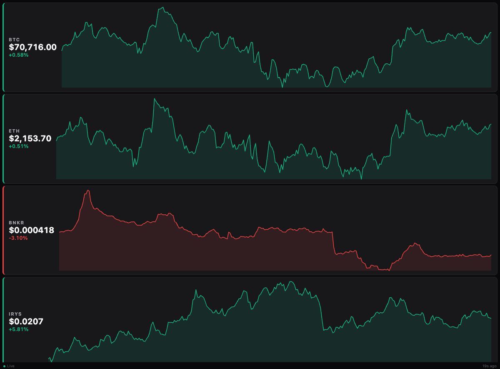

# Xeneon Crypto Tracker

A lightweight crypto price tracker widget for the **Corsair Xeneon Edge** touchscreen. Zero dependencies, self-contained HTML — just paste the iframe URL into iCUE.



## Quick Start

Paste this into an iCUE iframe widget:

```html
<iframe src="https://https://github.com/AkihideShoto/iCue-Crypto.html"></iframe>
```

That's it. Live prices and 24h sparkline charts for BTC, ETH, BNKR, and IRYS.

## Features

- **Live pricing** — updates every 30 seconds via CoinGecko API (free, no key needed)
- **24h sparkline charts** — drawn with native canvas, no Chart.js dependency
- **Zero external dependencies** — no Tailwind, no CDN fonts, no libraries to break
- **Offline resilient** — caches last-known prices in localStorage; shows cached data if API is rate-limited instead of blank/error screens
- **Status indicator** — green = live, red = cached/offline
- **Optimized for 1/3 panel** — vertical 4-coin stack designed for a single Xeneon Edge bay

## Customizing Coins

Edit the `COINS` array at the top of the `<script>` section in `crypto-tracker.html`:

```javascript
const COINS = [
  { id: 'bitcoin',      symbol: 'BTC'  },
  { id: 'ethereum',     symbol: 'ETH'  },
  { id: 'bankercoin-2', symbol: 'BNKR' },
  { id: 'irys',         symbol: 'IRYS' },
];
```

Use [CoinGecko coin IDs](https://www.coingecko.com/) — search for your coin and grab the ID from the URL.

### Common IDs

| Coin | CoinGecko ID |
|------|-------------|
| Bitcoin | `bitcoin` |
| Ethereum | `ethereum` |
| Solana | `solana` |
| BNB | `binancecoin` |
| Cardano | `cardano` |
| Dogecoin | `dogecoin` |
| XRP | `ripple` |

## Configuration

Other tunables at the top of the script:

```javascript
const PRICE_INTERVAL = 30_000;   // Price refresh (ms) — default 30s
const CHART_INTERVAL = 300_000;  // Chart refresh (ms) — default 5 min
```

## Self-Hosting

If you'd rather host it yourself instead of using GitHub Pages:

1. Clone this repo
2. Serve `crypto-tracker.html` from any static file server
3. Point your iCUE iframe to the URL

## Why Not the Nopeburger Widget?

The existing [nopeburger crypto tracker](https://github.com/nopeburger/nopeburger.github.io) is a great concept but breaks frequently due to:

- CoinGecko rate limits with no fallback (shows ERROR/spinners)
- External CDN dependencies (Tailwind, Chart.js, Google Fonts)
- No data persistence between reloads
- Designed for full-screen 2x2 layout, not a single bay

This widget solves all of those issues.

## License

MIT — do whatever you want with it.
